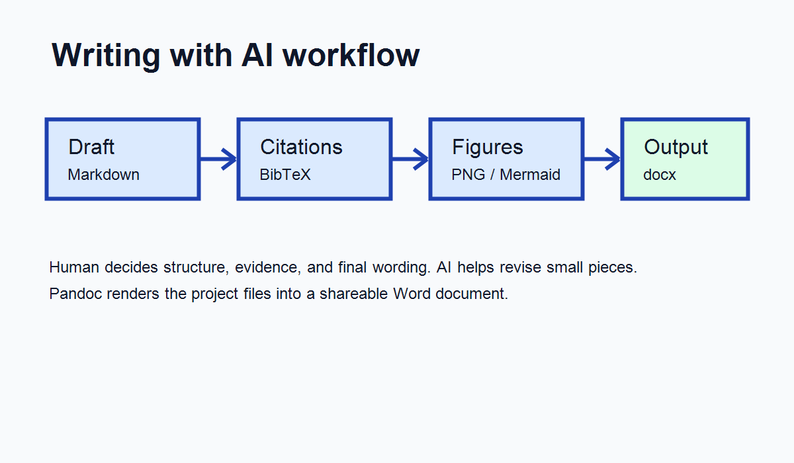

# Background

Clinical epidemiology projects often require repeated rewriting of the same core ideas for protocols, abstracts, manuscripts, and responses to reviewers. Large language models can support this process, but uncontrolled use may introduce fabricated citations or wording that overstates the evidence. Reporting guidelines such as PRISMA and STROBE remain useful anchors when researchers use AI during drafting [@page2021prisma; @vonelm2007strobe].

# Objective

This short demonstration shows how a manuscript draft can be managed as a project folder in an IDE. The goal is to separate the human decisions about structure, evidence, and interpretation from the AI-assisted work of revising language and generating document outputs.

# Methods

The draft is written in Markdown. References are stored in `refs.bib`, and citations are rendered with pandoc using a CSL file. Figures are stored under `assets/` and embedded by relative path.

The workflow has four steps:

1. Write or paste a rough draft into `draft.md`.
2. Ask the AI to revise one section at a time.
3. Keep citations restricted to entries in `refs.bib`.
4. Render the document to Word with pandoc.

# Results

The main output is a Word document generated from the Markdown file. The generated document should be checked manually, especially citation placement, figure captions, and any claim about study design or interpretation.

# ここに　demo\assets\study_flow.drawio　からpngにして追加して

# Discussion

AI-assisted writing is most useful when the project files are explicit and the revision target is narrow. For example, asking the AI to revise only the Background section is easier to review than asking it to rewrite the whole manuscript. The researcher remains responsible for the argument, the evidence, and the final wording.

# AI disclosure example

We used Antigravity 1.18.3 with Claude Opus 4.6 (Anthropic) and/or Gemini 3.1 pro etc. to assist in editing manuscript. All outputs were critically reviewed, executed, and verified by the authors.

