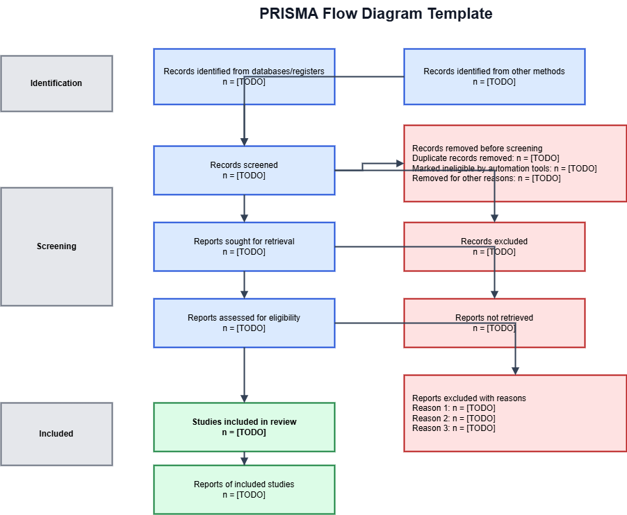

# Background

Clinical epidemiology projects often require repeated rewriting of the same core ideas for protocols, abstracts, manuscripts, and responses to reviewers. Large language models can support this process, but uncontrolled use may introduce fabricated citations or wording that overstates the evidence. Reporting guidelines such as PRISMA and STROBE remain useful anchors when researchers use AI during drafting [@page2021prisma; @vonelm2007strobe].

# Objective

This short demonstration shows how we can manage a manuscript draft as a project folder in an IDE. The goal is to separate the human decisions about structure, evidence, and interpretation from the AI-assisted work of revising language and generating document outputs.

# Methods

## Study design and setting

This was a single-center retrospective cohort study using electronic medical records. The study was conducted in the cardiology department of a single tertiary care hospital in Japan. The study period included patients discharged between 2022-04-01 and 2024-03-31.

## Participants

Eligible participants were patients aged 65 years or older at admission with a primary diagnosis of acute myocardial infarction (ICD-10: I21.x). Patients were included if they were discharged alive during the study period. Patients were excluded if they died during the index admission, were transferred to another hospital, or had missing data on cardiac rehabilitation participation or readmission status. The number of eligible participants was [TODO: 確認].

## Exposure and outcome definitions

The exposure was outpatient cardiac rehabilitation participation, defined as attending at least one outpatient cardiac rehabilitation session within 3 months of discharge based on billing codes. The comparator was no outpatient cardiac rehabilitation participation within 3 months of discharge. The outcome was cardiovascular readmission within 365 days of discharge, defined as an unplanned admission with a primary cardiovascular diagnosis (ICD-10: I00-I99).

## Statistical analysis

Baseline characteristics were summarized by exposure group, with continuous variables presented as mean (SD) and categorical variables as n (%). A 2x2 table of exposure and outcome was used to estimate the unadjusted risk ratio with a 95% confidence interval. Logistic regression was used to estimate adjusted odds ratios with 95% confidence intervals for the association between cardiac rehabilitation participation and 1-year readmission, adjusting for age, sex, and diabetes mellitus. Missing data were handled using complete-case analysis.

# Results

The main output is a Word document generated from the Markdown file. The generated document should be checked manually, especially citation placement, figure captions, and any claim about study design or interpretation.

# Discussion

AI‑assisted manuscript drafting can streamline the writing process while preserving scientific rigor when the workflow is well‑structured. By separating the human‑driven decisions (study design, evidence appraisal, interpretation) from the AI‑driven language refinement, researchers can focus on substantive content and reduce the risk of inadvertent factual errors. This approach also facilitates transparent reporting: all code, data, and intermediate drafts are version‑controlled, making it straightforward to audit changes and ensure reproducibility. Nonetheless, authors must verify AI‑generated text, confirm citation accuracy, and adhere to reporting standards such as PRISMA and STROBE.

# AI disclosure example

We used Antigravity 1.18.3 with Claude Opus 4.6 (Anthropic) and/or Gemini 3.1 pro etc. to assist in editing manuscript. All outputs were critically reviewed, executed, and verified by the authors.
