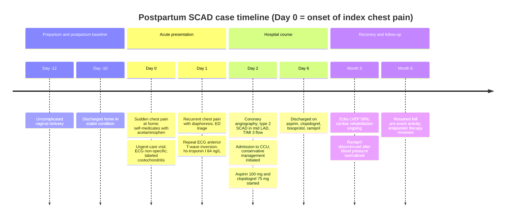

<!-- case-timeline: see assets/timeline.mmd for the source file. -->

```mermaid
timeline
    title Postpartum SCAD case timeline (Day 0 = onset of index chest pain)
    section Prepartum and postpartum baseline
      Day -12 : Uncomplicated vaginal delivery
      Day -10 : Discharged home in stable condition
    section Acute presentation
      Day 0  : Sudden chest pain at home; self-medicates with acetaminophen
             : Urgent-care visit; ECG non-specific; labeled costochondritis
      Day 1  : Recurrent chest pain with diaphoresis; ED triage
             : Repeat ECG anterior T-wave inversion; hs-troponin I 84 ng/L
    section Hospital course
      Day 2  : Coronary angiography; type 2 SCAD in mid LAD, TIMI 3 flow
             : Admission to CCU; conservative management initiated
             : Aspirin 100 mg and clopidogrel 75 mg started
      Day 6  : Discharged on aspirin, clopidogrel, bisoprolol, ramipril
    section Recovery and follow-up
      Month 3 : Echo LVEF 58%; cardiac rehabilitation ongoing
              : Ramipril discontinued after blood pressure normalized
      Month 6 : Resumed full pre-event activity; antiplatelet therapy reviewed
```
